# WebGL GLSL Editor

This extension adds language support for GLSL ES 100 (WebGL 1 and OpenGL ES 1.00) and GLSL ES 300 (WebGL 2 and OpenGL ES 3.00). It supports all the WebGL compatible GLSL extensions too. It supports most of the well-known VS Code language features like syntax highlight, IntelliSense and more, see the details below.

## Features

### Syntax highlight

The extension colorizes types, builtin types, variables, builtin variables, functions, keywords, qualifiers, operators, preprocessor directives and comments.

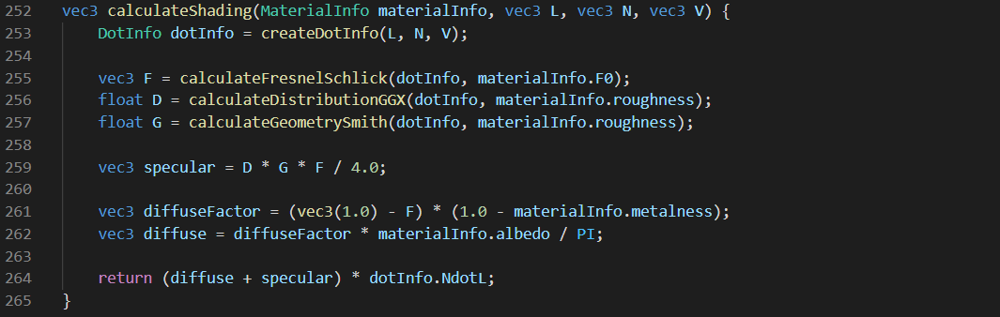

### Diagnostic

The extension uses [glslang](https://github.com/KhronosGroup/glslang), the Khronos Group's reference GLSL compiler to provide diagnostic informations (errors and warnings). It also grays out the unused functions, types and variables.

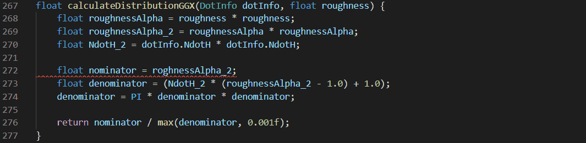

### Offline documentation

The extension uses [docs.gl](http://docs.gl) to provide the offline documentation for builtin variables and builtin functions.

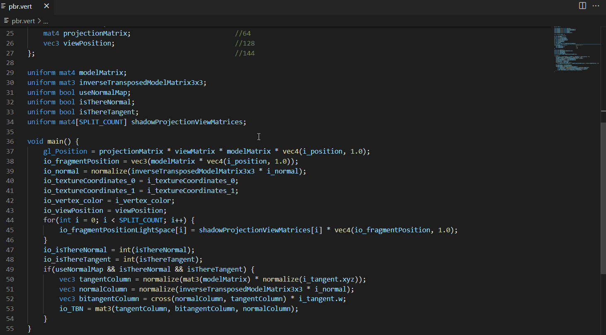

### Signature help

The extension can display a signature helper for functions and constructors (except matrix constructors).

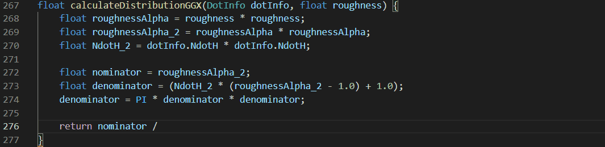

### Code completion

The extension provides types, variables, functions, constructors, keywords, qualifiers, qualifier parameters, preprocessor directives and code snippets using IntelliSense, accoarding to the current scope and shader stage. Member variables and vector swizzles are also supported.

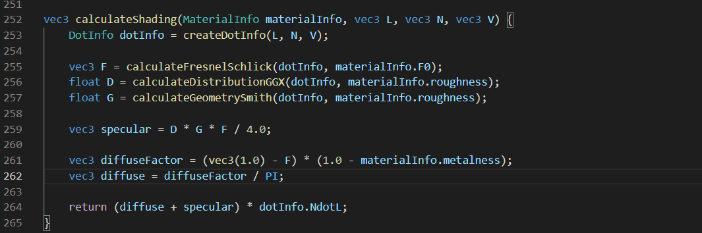

### Formatting

The extension can format the whole source code and it can format a region of the source code. The formatting is customizable in the Settings.

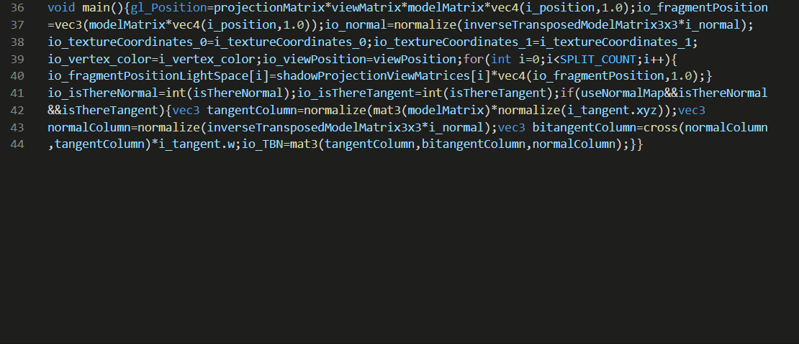

### Syntax highlight in HTML scripts

The extension can colorize GLSL code in HTML scripts if the script's type is `x-shader/x-vertex` or `x-shader/x-fragment`.

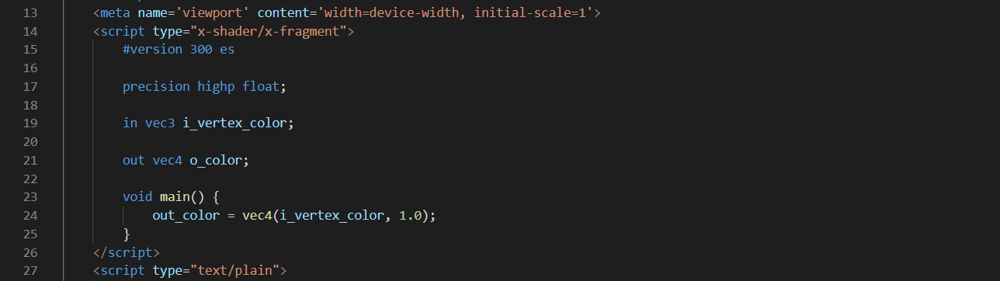

### Rename

You can rename types (and constructors), interface blocks, variables and functions.

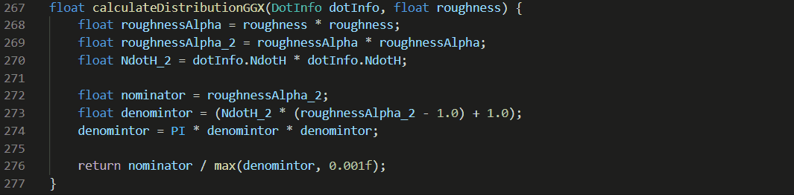

### Highlights

The extension can highlight all the occurrences of the selected type, variable function or constructor.

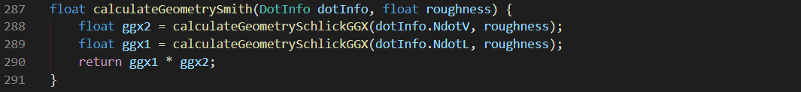

### Hover

The extension can provide useful informations or documentation summary if you hover over types, variables, functions or constructors.

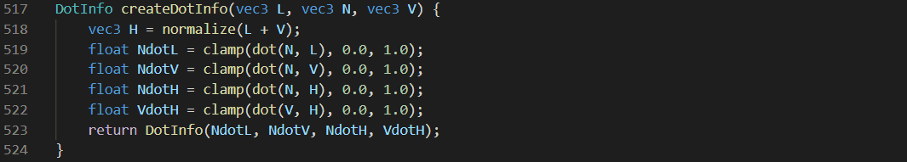

### Symbols

The extension can provide outline information and breadcrumbs about the types, interface blocks, variables and functions. You can also easily find them by typing a `@` into the Command Palette.

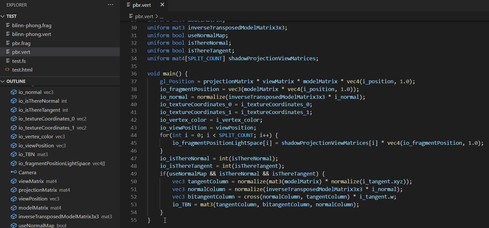

### Inlay hints

The extension can show function and constructor parameters in the source code. You can enable or disable this feature in the Settings.

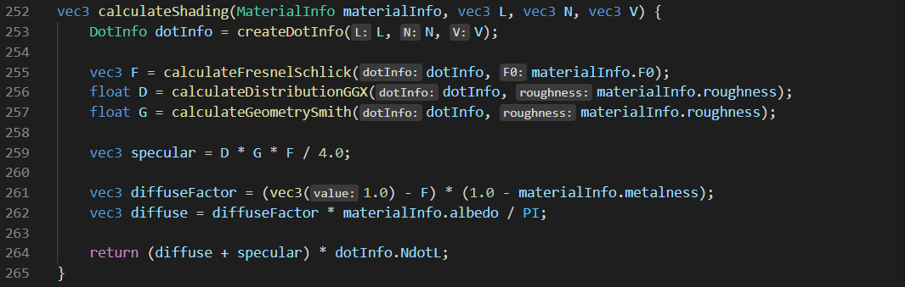

### Color picker

The extension can display a color picker if you initialize or reassign a `vec3` or `vec4` variable whihch name contains the word `color` or `colour` and the assigned expression is a `vec3` or `vec4` constructor and it's parameters are number literals.

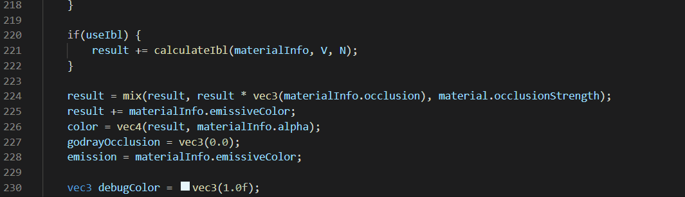

### Code injection

The extension can inject code into the GLSL files. You can specify the code in the Settings.

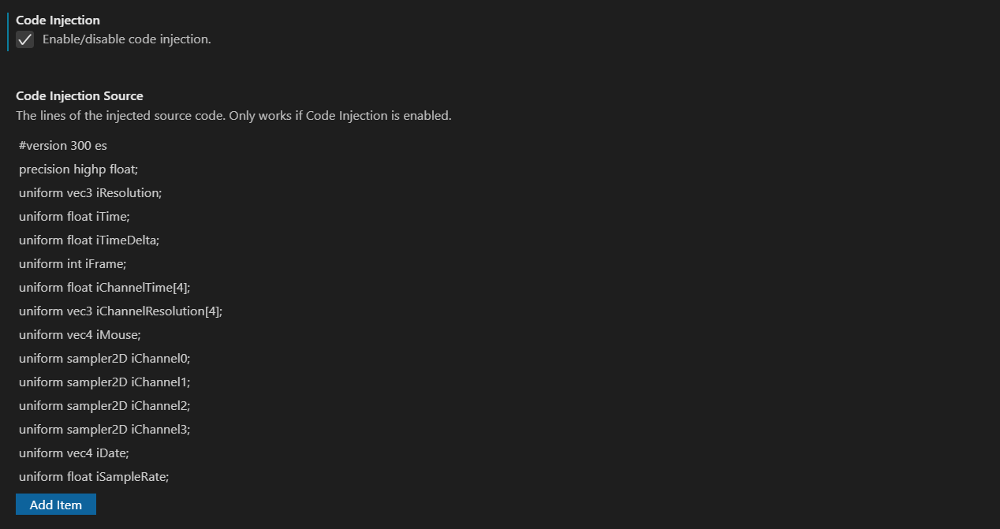

### Show/Peek call hierarchy

The extension can visualize the functions' and constructors' incoming ang outgoing calls as a graph.

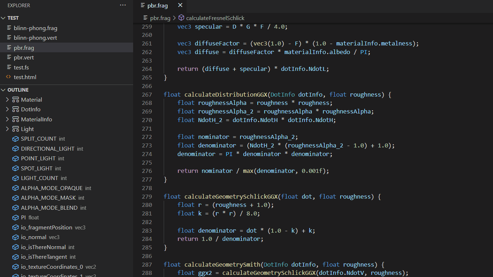

### Go to/Peek declarations

You can find (go to / peek) the declaration of a type, a variable, a function or a constructor.

### Go to/Peek definitions

You can find (go to / peek) the definition of a type, a variable, a function or a constructor.

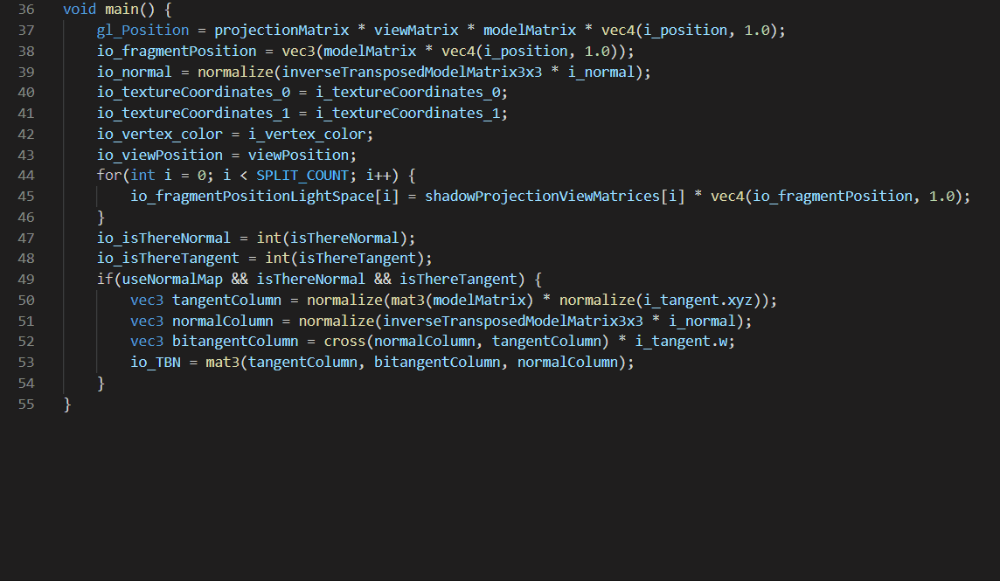

### Go to/Peek type definitions

You can find (go to / peek) the type definition of a variable, a function or a constructor.

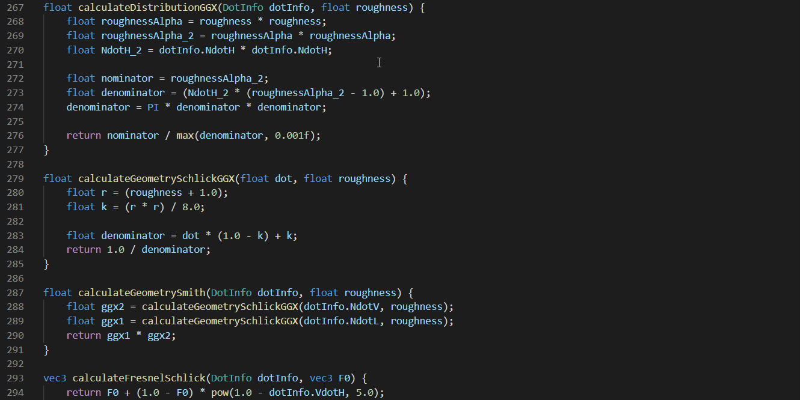

### Go to/Find all/Peek implementations

You can find (go to / find all / peek) the implementation of a function.

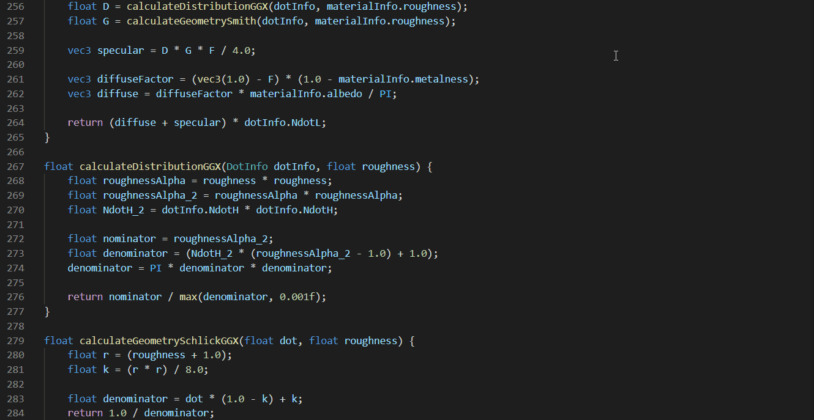

### Go to/Find all/Peek references

You can find (go to / find all / peek) the references of a type, a variable, a function or a constructor.

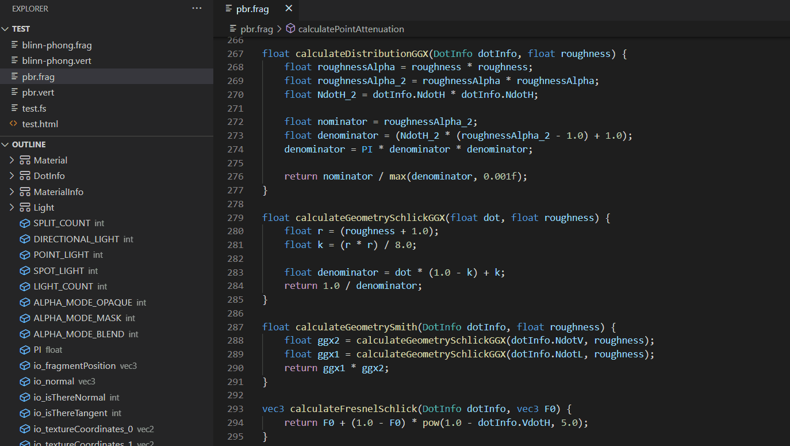

### Generating preprocessed GLSL source code

You can generate preprocessed GLSL source code by running a command.

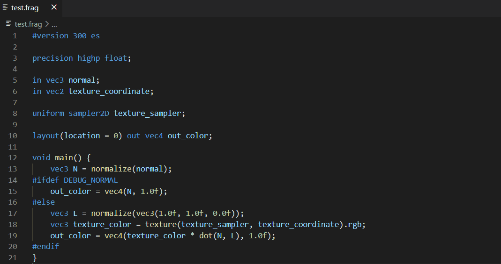

### Folding

You can collapse or expand code blocks.

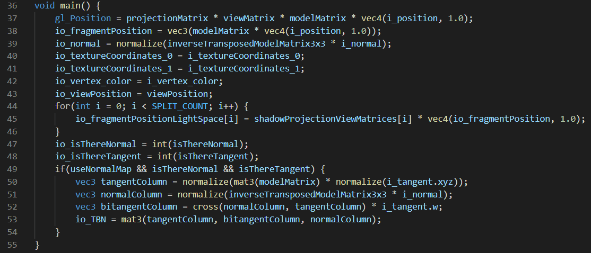

### Commands for online documentation

You can easily access several online documentations by commands.

### Other features

* Indentation
* Brace matching
* Comment toggling
* Autoclosing pairs
* Surrounding pairs

## Configuration

* `webgl-glsl-editor.inlayHints`: Enables/disables inlay hints.
* `webgl-glsl-editor.strictRename`: Prevents invalid renames.
* `webgl-glsl-editor.alwaysOpenOnlineDoc`: Documentation is always opened online in the browser.
* `webgl-glsl-editor.alwaysOpenOfflineDocInNewTab`: Offline documentation is always opened in new tab.
* `webgl-glsl-editor.format.placeBracesOnSeparateLine`: Places the braces on separate lines.
* `webgl-glsl-editor.format.placeSpaceAroundUnaryOperators`: Places a space between the unary operators and the operands.
* `webgl-glsl-editor.format.placeSpacesAroundBinaryOperators`: Places spaces around the binary operators.
* `webgl-glsl-editor.format.placeSpacesAroundAssignmentOperators`: Places spaces around the assignment operators.
* `webgl-glsl-editor.format.placeSpacesAroundTernaryOperators`: Places spaces around the ternary operators.
* `webgl-glsl-editor.format.placeSpaceAfterKeywords`: Places a space between keywords and the opening parentheses.
* `webgl-glsl-editor.format.placeSpaceAfterFunctionNames`: Places a space between function names and the opening parentheses.
* `webgl-glsl-editor.format.placeSpaceBeforeCommas`: Places a space before commas.
* `webgl-glsl-editor.format.placeSpaceAfterCommas`: Places a space after commas.
* `webgl-glsl-editor.format.placeSpacesAroundDots`: Places spaces around dots.
* `webgl-glsl-editor.format.placeSpaceBeforeCaseColons`: Places a space before colons in `case`s and `default`s.
* `webgl-glsl-editor.format.placeSpaceBeforeSemicolonsInFor`: Places a space before semicolons in `for`s.
* `webgl-glsl-editor.format.placeSpaceAfterSemicolonsInFor`: Places a space after semicolons in `for`s.
* `webgl-glsl-editor.format.placeSpacesInsideParentheses`: Places spaces inside parentheses.
* `webgl-glsl-editor.format.placeSpacesAroundBraces`: Places spaces around braces.
* `webgl-glsl-editor.format.placeSpaceBeforeOpeningBrackets`: Places a space before opening brackets.
* `webgl-glsl-editor.format.placeSpacesInsideBrackets`: Places spaces inside brackets.
* `webgl-glsl-editor.codeInjection`: Enables/disables code injection.
* `webgl-glsl-editor.codeInjectionSource`: The lines of the injected source code. Only works if Code Injection is enabled.

## Notes

* If you use this extension as a web extension, only the syntax highlight, limited indentation and the features listed as "Other features" will work
* If you open GLSL code embedded in HTML, only the syntax highlight and limited indentation will work

## Known Issues

* Preprocessor directives may cause problems
* Incorrect GLSL code (like an if statement without parentheses) may cause problems

You can find the user provided issues on [GitHub](https://github.com/racz16/WebGL-GLSL-Editor/issues). Feel free to add new issues, but please provide some sort of informations to I can reproduce the problem.

## Release Notes

For more information, see the [changelog](CHANGELOG.md).

### 1.3.1

* Added diagnostic support for compound file extensions (thanks RAX7)
* Other small changes

### 1.3.0

* Inlay hints
* Available as a web extension
* Improved formatting
* Improved syntax highlight
* Improved call hierarchy
* Improved references
* Improved highlight
* Improved brace matching
* Other small changes and bugfixes

### 1.2.2

* Improved code completion
* Other small changes and bugfixes

### 1.2.1

* Support for the extensions
* Range formatting
* Generating preprocessed GLSL
* Improved code completion
* Improved syntax highlight
* Improved diagnostic
* Other small changes and bugfixes

### 1.2.0

* Formatting
* Syntax highlight in HTML scritps
* Code injection
* Improved folding
* Other small changes and bugfixes

### 1.1.1

* Improved diagnostic
* Other small changes and bugfixes

### 1.1.0

* Function signature helper
* Call hierarchy
* Color picker
* Generating Shadertoy variables
* Improved syntax highlight
* Improved code completion
* Improved diagnostic
* Other small changes and bugfixes

### 1.0.1

* Improved syntax highlight
* Other small changes and bugfixes

### 1.0.0

* Syntax highlight
* Diagnostics
* Offline documentation
* Code completion
* Rename
* Highlights
* Hover
* Symbols
* Go to/Peek declarations
* Go to/Peek definitions
* Go to/Peek type definitions
* Go to/Find all/Peek implementations
* Go to/Find all/Peek references
* Commands for online documentation

## Contributions

Special thanks to [michaelmcleodnz](https://github.com/michaelmcleodnz) and [RAX7](https://github.com/RAX7) for contributing.

## How to build, run and package the extension

[Detailed build instructions](BUILD.md)
