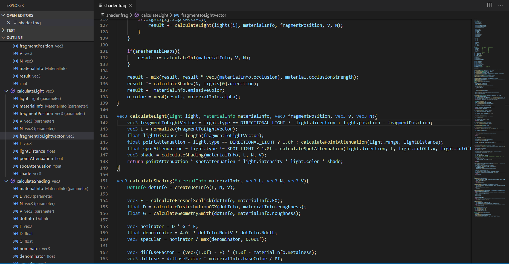
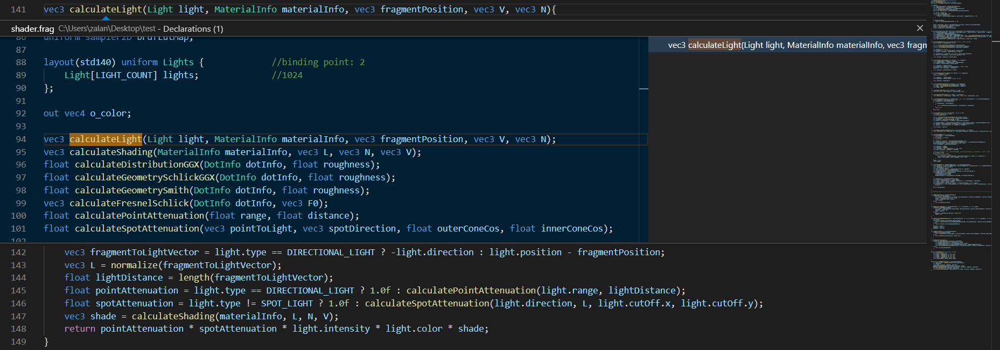
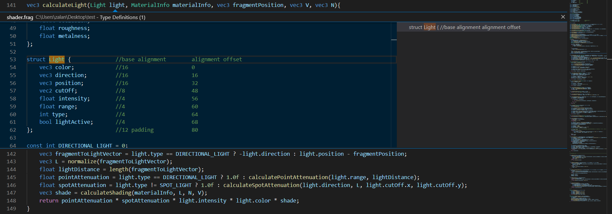
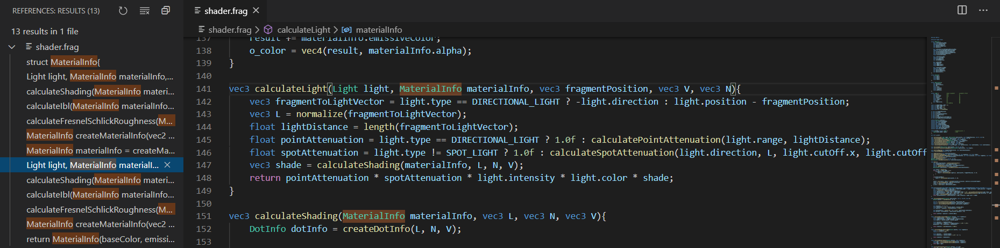

# WebGL GLSL Editor
This extension adds language support for GLSL ES 100 (WebGL 1 and OpenGL ES 1.00) and GLSL ES 300 (WebGL 2 and OpenGL ES 3.00). It supports most of the well-known VS Code language features like syntax highlight, IntelliSense and more, see the details below.

## Features
### Syntax highlight
The extension colorizes types, builtin types, variables, builtin variables, functions, keywords, qualifiers, operators, macros and comments.

### Diagnostics
The extension uses [glslang](https://github.com/KhronosGroup/glslang), the Khronos Group's reference GLSL compiler to provide diagnostic informations.

### Offline documentation
The extension uses docs.gl to provide the offline documentation for builtin variables and builtin functions.

### Code completion
The extension provides types, variables, functions, constructors, keywords, qualifiers, qualifier parameters and code snippets using IntelliSense, accoarding to the current scope and shader stage. Member variables and vector swizzles are also supported.

### Rename
You can rename types (and constructors), interface blocks, variables and functions.

### Highlights
The extension can highlight all the occurrences of the selected type, variable function or constructor.

### Hover
The extension can provide useful informations or documentation summary if you hover over elements.

### Symbols
The extension can provide outline information and breadcrumbs about the types, variables and functions.

You can easily find types, interface blocks, variables and functions.

### Go to/Peek declarations
You can find (go to / peek) the declaration of a type, a variable, a function or a constructor.

### Go to/Peek definitions
You can find (go to / peek) the definition of a type, a variable, a function or a constructor.

### Go to/Peek type definitions
You can find (go to / peek) the type definition of a variable, a function or a constructor.

### Go to/Find all/Peek implementations
You can find (go to / find all / peek) the implementation of a function.

### Go to/Find all/Peek references
You can find (go to / find all / peek) the references of a type, a variable, a function or a constructor.

### Commands for online documentation
You can easily access several online documentations by commands.

## Configuration
* `webgl-glsl-editor.strictRename`: Prevents invalid renames
* `webgl-glsl-editor.alwaysOpenOnlineDoc`: Documentation is always opened online in the browser
* `webgl-glsl-editor.alwaysOpenOfflineDocInNewTab`: Offline documentation is always opened in new tab

## Known Issues
You can find the known issues on [GitHub](https://github.com/racz16/WebGL-GLSL-Editor/issues). Feel free to add new issues, but please provide some sort of informations to I can reproduce the problem.

## Release Notes
For more information, see the [changelog](CHANGELOG.md).

### 1.0.0
- Syntax highlight
- Diagnostics
- Offline documentation
- Code completion
- Rename
- Highlights
- Hover
- Symbols
- Go to/Peek declarations
- Go to/Peek definitions
- Go to/Peek type definitions
- Go to/Find all/Peek implementations
- Go to/Find all/Peek references
- Commands for online documentation

## License
Copyright 2020 Rácz Zalán

Permission is hereby granted, free of charge, to any person obtaining a copy of this software and associated documentation files (the "Software"), to deal in the Software without restriction, including without limitation the rights to use, copy, modify, merge, publish, distribute, sublicense, and/or sell copies of the Software, and to permit persons to whom the Software is furnished to do so, subject to the following conditions:

The above copyright notice and this permission notice shall be included in all copies or substantial portions of the Software.

THE SOFTWARE IS PROVIDED "AS IS", WITHOUT WARRANTY OF ANY KIND, EXPRESS OR IMPLIED, INCLUDING BUT NOT LIMITED TO THE WARRANTIES OF MERCHANTABILITY, FITNESS FOR A PARTICULAR PURPOSE AND NONINFRINGEMENT. IN NO EVENT SHALL THE AUTHORS OR COPYRIGHT HOLDERS BE LIABLE FOR ANY CLAIM, DAMAGES OR OTHER LIABILITY, WHETHER IN AN ACTION OF CONTRACT, TORT OR OTHERWISE, ARISING FROM, OUT OF OR IN CONNECTION WITH THE SOFTWARE OR THE USE OR OTHER DEALINGS IN THE SOFTWARE.

For diagnostics, the extension uses the glslang, you can read it's license here: [glslang license](https://raw.githubusercontent.com/KhronosGroup/glslang/master/LICENSE.txt).

For the documentation, the extension uses docs.gl, you can read it's license here: [docs.gl license](http://docs.gl/about.html).
